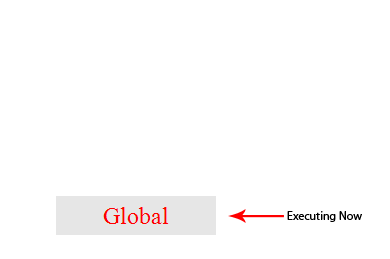

寫專案的過程中時常會遇到 JavaScript 執行順序的問題，JS 本身的底層運作機制觀念是相當重要且實用，是每位前端工程師必備的觀念。

---

JavaScript 是單執行緒(single thread)的語言，單執行緒的意思是說 JS 在執行的任何時候，都只會有一個主線程在處理任務。

而無法立刻返回結果，需要花一定時間才能完成的任務，主線程會掛起這個任務（pending），然後在異步(asynchronous)返回結果的時候再根據一定規則去執行相應的 callback。

然而單執行緒在保證了執行順序的同時也限制了 JS 的效率，因此開發出了 web worker，這讓 JS 能夠號稱是多線程的語言。

JS 另一個特點是非阻塞，那 JavaScript 是如何實現的這點的呢？ 那就是 Event Loop（事件循環）。

###執行堆疊(execution stack) 與 事件佇列(task queue)###

當 JS 執行的時候會將不同的變數存在記憶體中不同的位置：堆積區(heap)和 堆疊區(stack)中。其中，堆積區放著一切物件。而堆疊區則存放一切基礎類型變數以及物件的指向(pointer)。

當我們調用一個函數的時候，JS 會生成一個與這個函數相對應的執行環境(context)。這個執行環境中存在著這個函數的私有作用域(scope)，上層作用域的指向，函數的參數，這個作用域的變數以及這個作用域的 this。 而當很多函數被調用的時候，JS 是單執行緒的，同一時間只能執行一個函數，於是這些函數就排隊等待執行，而這個排隊的地方就叫做 execution stack 又或者叫 call stack。

當程式開始執行的時候 JS 會開始解析這些程式碼，並將其中同步(synchronous)的程式碼按照執行順序加入 call stack 中，然後從頭開始執行。如果當前執行的是一個函數，那麼 JS 會把這個函數加進這個函數的執行環境的 call stack 中，然後進入這個執行環境繼續執行這個環境中的其他程式碼。當這個執行環境中的程式碼執行完畢並返回結果後，JS 會離開這個執行環境並把這個執行環境銷毀，然後回到上一個函數的執行環境。這個過程會重複進行，直到 call stack 裡沒有需要執行的函數為止。

call stack 執行順序

以上所說的都是同步的執行，如果是異步呢？(像是發送ajax請求)，前面有提過 JS 有另外一個特點就是非阻塞，實現這項特點的關鍵機制就是—事件佇列(Task Queue)。

當遇到一個異步事件時並不會一直等待其返回結果，而是會將整個事件掛起(pending)，繼續執行 call stack。當異步事件處理完畢返回結果時，JS 會將這個事件加入到與 call stack 不同的佇列當中，我們稱之為 事件佇列(Task Queue)。被放進事件佇列並不會立刻執行其回調(callback)，而是等待當前 call stack 中的所有任務執行完畢，call stack 處於閒置狀態時，call stack 會去看事件佇列裡是否有任務要執行。如果有，那麼 call stack 會取出事件佇列裡的排在第一位的事件，並把這個事件相對應的 callback 放入 call stack 中，然後執行其中的同步程式碼，如此反複，這樣就形成了一個無限的循環。這就是被稱為事件循環(Event Loop)的原因。

 
Event Loop 事件循環

###Microtask 與 Macrotask###

異步的任務也有執行優先順序上的不同，而不同的執行順序分為兩類: Microtask 及 Macrotask。

**Microtask:**
- setTimeout()
- setInetrval()

**Macrotask:**
- new Promise()
- new MutationObserver()

在一個事件循環中，我們知道異步任務完成返回結果的時候會被丟進一個 callback queue 中，但依據類型的不同實際上會被丟進 microtask 或者是 macrotask 的佇列中，而當主線程完成當前所有任務的時候會去看看 microtask 是否有任務需要執行，microtask、macrotask 這邊採的是先進先出與 call stack 的先進後出不同，如果有的話就將 microtask 裡的任務全部執行完，然後抓取 macrotask 第一個任務執行，如果沒有的話則直接抓取 macrotask 的第一個任務執行，如此反複。

我們只需要知道屬於 microtask 的異步任務有哪些，屬於 macrotask 的又有哪些，而主線程完成當前的任務時會去立刻處理 microtask queue 裡的任務，然後再去 microtask queue 裡抓取第一個任務，且同一次事件循環中，microtask 永遠在 macrotask 前執行。

 
Microtask and Macrotask 執行順序

不同的瀏覽器有不同的執行順序，出來的結果可能與你想的不一樣，想更深入了解的朋友可以看<a href="https://jakearchibald.com/2015/tasks-microtasks-queues-and-schedules/" target="_blank" title="tasks-microtasks">這篇</a>

以上是 JavaScript 的執行順序介紹，有興趣也可以來<a href="http://latentflip.com/loupe/" target="_blank" title="loupe ">這裡</a>動手玩玩看，我認為理解 JS 的執行順序在實作中是非常重要的，時常會遇到執行先後順序不同，而導致輸出結果不是自己所想要的問題。

###參考資料###
- https://jakearchibald.com/2015/tasks-microtasks-queues-and-schedules/
- https://zhuanlan.zhihu.com/p/33058983
